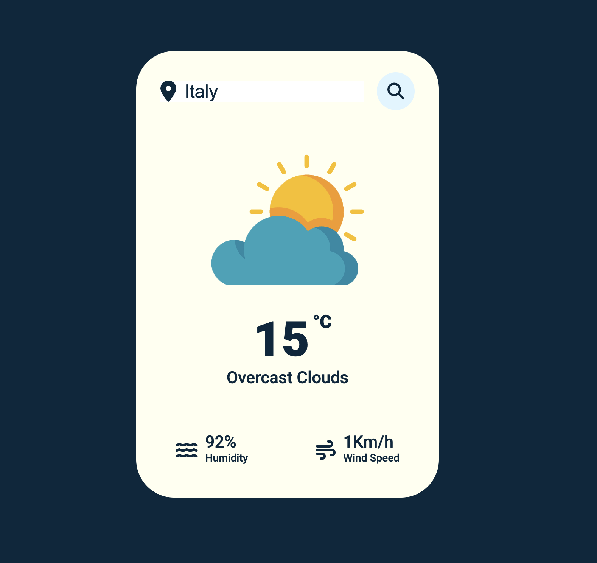

# Weather-App

> [!NOTE]
> This is a weather web application built with HTML, CSS and Javascript.


> [!WARNING]
> You need to get your own API key and replace it in index.js file on line 10 :


```javascript
    const APIKey = 'Your API Key';
```
# Screenshot


